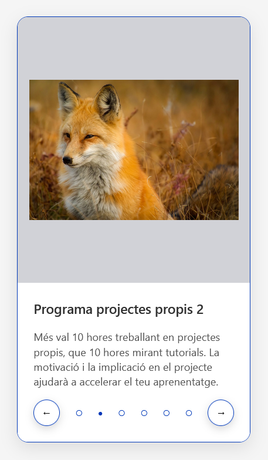
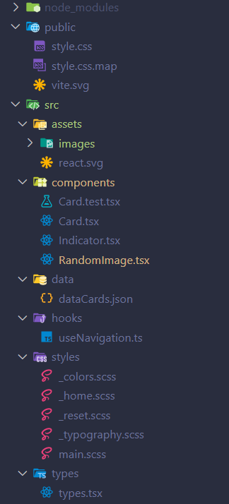
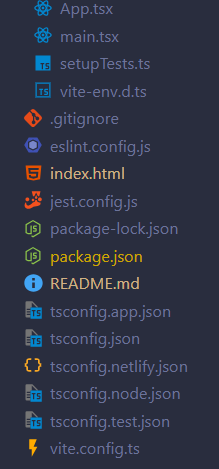

# 🎓 2025-S5 Pràctica Acadèmica / 2025-S5 Academic Practice

Albert Valls



## 📚 Índex / Table of Contents

1. [Sobre el projecte / About](#1-sobre-el-projecte--about)
2. [Funcionalitats / Features](#2-funcionalitats--features)
3. [Tecnologia / Tech Stack](#3-tecnologia--tech-stack)
4. [Demo en línia / Live Demo](#4-demo-en-línia--live-demo)
5. [Repositori / Repository](#5-repositori--repository)
6. [Estructura / Structure](#6-estructura--structure)
7. [Instal·lació / Installation](#7-instal·lació--installation)

## 1. Sobre el projecte / About

**CAT:**  
Aquest projecte és una aplicació escrita en React amb TypeScript i configurada amb Vite. L’objectiu principal és crear un component Card que permeti canviar entre diverses targetes mitjançant injecció de contingut per props, així com implementar una navegació ordenada entre les cards.

En una primera versió es va crear un component addicional anomenat Indicador, tal com sol·licitava l’exercici 5. Després de veure que l’ús de més de sis props entre components dificulta el manteniment, ja que augmenta la complexitat i el risc d’errors de sincronització de dades, vam decidir centralitzar la lògica de navegació en un hook personalitzat. Tot i això, hem mantingut una branca específica amb el component Indicador per complir amb el requisit : pots visitar la branca "feature/indicator" per veure el codi.

Com a extra, hem afegit una crida a l’API externa RandomFox per obtenir fotografies aleatòries, la qual cosa ens ha servit per practicar la creació de nous components i l’ús d’APIs externes.

A més, hem incorporat transicions entre diapositives usant SASS i aplicant classes CSS mitjançant la lògica de TypeScript.

També hem implementat tests amb Jest per comprovar el correcte funcionament d’algunes funcionalitats clau, com la navegació entre cards i la injecció de props.

**EN:**  
This project is built with React and TypeScript, scaffolded using Vite. The main goal is to develop a Card component that can display multiple cards by injecting content via props, and to implement an ordered navigation between these cards.

In the initial version, we created an additional Indicator component as required by exercise 5. However, we found that passing more than six props between components hampers maintainability, increases complexity, and raises the risk of data synchronization errors. To address this, we refactored the navigation logic into a custom hook. We still maintain a dedicated branch "feature/indicator" containing the original Indicator component implementation to satisfy the exercise requirement.

As an extra feature, we integrated the RandomFox external API to fetch random images, providing additional practice in creating new components and consuming external APIs.

We also added slide transitions using SASS, and dynamically applied CSS classes through TypeScript logic.

In addition, we implemented Jest tests to verify the correct behavior of key functionalities, such as card navigation and props injection.

## 2. Funcionalitats / Features

- ✅ **React**
- ✅ **TypeScript → JavaScript**
- ✅ **Vite**
- ✅ **External API integration**
- ✅ **SASS**

## 3. Tecnologia / Tech Stack

- **React (18.2)**
- **Vite**
- **JavaScript (ES6+)**
- **TypeScript**
- **Jest**
- **SASS**
- **CSS**
- **Git & GitHub**
- **API REST**

## 4. Demo en línia / Live Demo

**Live:** 👉 https://s5-albertvalls.netlify.app/

**CAT:**  
Visita la demo en línia per veure l’aplicació en funcionament.

**EN:**  
Check out the live demo to see the application in action.

## 5. Repositori / Repository

**Github:** 👉 https://github.com/albertvallsbe/2025-s5-albertvalls

## 6. Estructura / Structure

**CAT:**  
La següent imatge mostra l’estructura de carpetes principal del projecte:

**EN:**  
The following image illustrates the main folder structure of the project:




```
2025-s4-albertvalls/
├── node_modules/
├── public/
│   ├── style.css
│   ├── style.css.map
│   └── vite.svg
├── src/
│   ├── assets/
│   │   ├── images/
│   │   │   ├── cardImage.png
│   │   │   ├── treeImage_1.png
│   │   │   └── treeImage_2.png
│   │   └── react.svg
│   ├── components/
│   │   ├── Card.test.tsx
│   │   ├── Card.tsx
│   │   └── RandomImage.tsx
│   ├── data/
│   │   └── dataCards.json
│   ├── hooks/
│   │   └── useNavigation.ts
│   ├── styles/
│   │   ├── _colors.scss
│   │   ├── _home.scss
│   │   ├── _reset.scss
│   │   ├── _typography.scss
│   │   └── main.scss
│   ├── types/
│   │   └── types.tsx
│   ├── App.tsx
│   ├── main.tsx
│   ├── setupTests.ts
│   └── vite-env.d.ts
├── .gitignore
├── eslint.config.js
├── index.html
├── jest.config.js
├── package-lock.json
├── package.json
├── README.md
├── tsconfig.app.json
├── tsconfig.json
├── tsconfig.netlify.json
├── tsconfig.node.json
├── tsconfig.test.json
└── vite.config.ts
```

## 7. Instal·lació / Installation

**CAT:**

_Segueix aquests passos per clonar el projecte i fer servir el compilador TypeScript en mode “watch” i executa els estils amb SASS també en mode "watch"._

**EN:**

Follow these steps to clone the project, use the TypeScript compiler in “watch” mode, and run the styles with SASS also in “watch” mode.\_

**Requeriments / Prerequisites**

- Node.js

### 1) Clonar el repositori / Clone the repository

```bash
git clone https://github.com/albertvallsbe/2025-s5-albertvalls.git
```

### 2) Entrar al directori del projecte / Navigate into the project directory

```
cd 2025-s5-albertvalls
```

### 3) Instal·lar dependències / Install dependencies

```
npm i
```

### 4) Executar el compilador de Vite per a desenvolupament / Run Vite compiler in developer mode

```
npm run dev
```

### 6) Obre el live Server de Vite / Open the Live Server of Vite

```
http://localhost:5173
```
